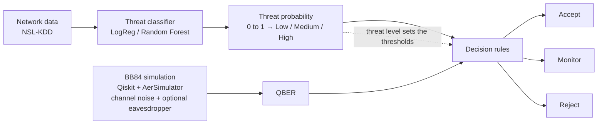
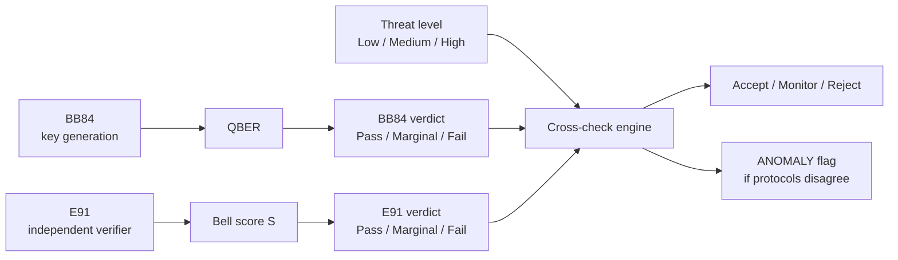
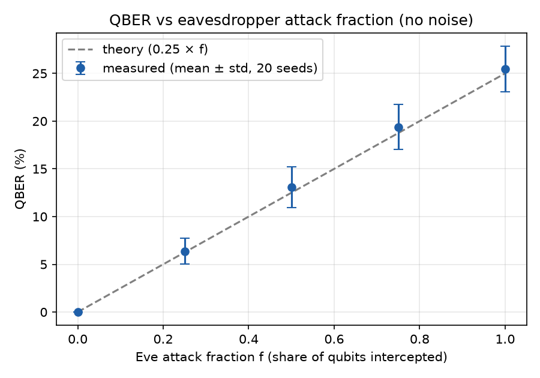
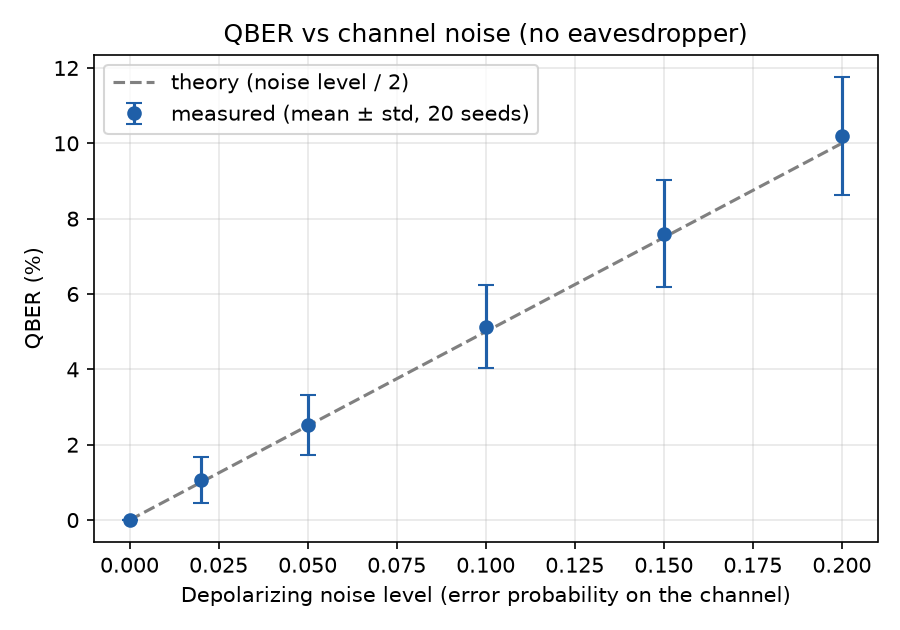
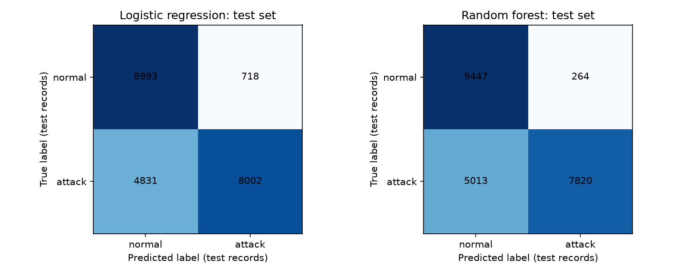
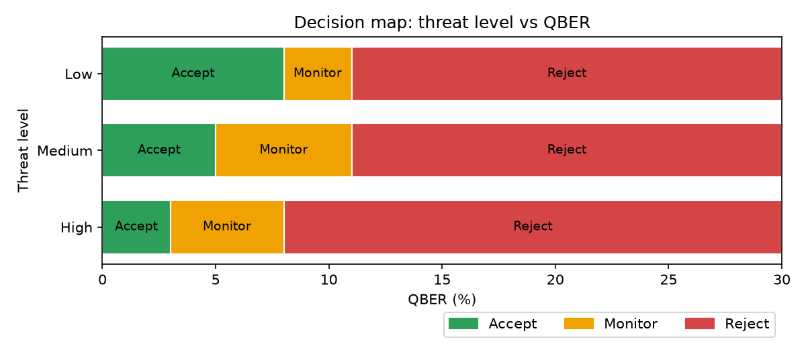
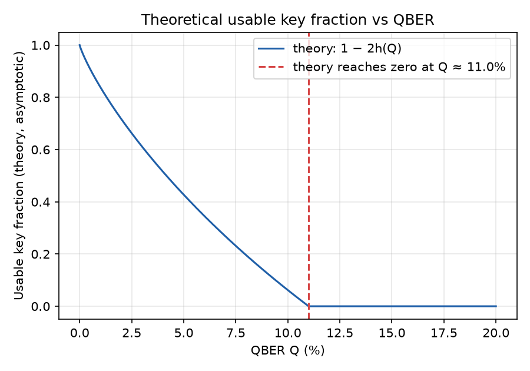
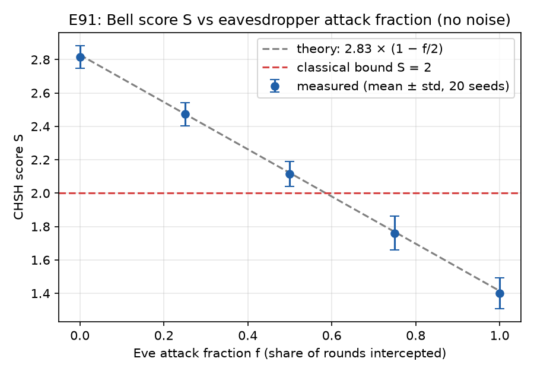

# Threat-Aware Quantum-Secure Communication for Biomedical Networks

**One-line pitch:** A network-threat classifier tells a simulated BB84 quantum key exchange how strict to be, so the same quantum error rate can lead to Accept, Monitor or Reject depending on how hostile the network looks.

**Event:** Qiskit Fall Fest 2026, Overnight Quantum Computing Hackathon (IBM Qiskit)
**Track:** Track 2, Quantum Cryptography and Communication: *Quantum-Secure Communication for Biomedical Networks*
**Team:** Daily Limit Reached

> **Status:** The core pipeline is built and runs top to bottom in `threat_aware_qkd.ipynb` (about 5 minutes on a laptop): threat classifier, BB84 with channel noise and an eavesdropper, decision rules, scenario table and plots, plus two extensions: confidence-interval verdicts and an E91 cross-check with an ANOMALY flag. The other extensions are **not built**. All results below come from our own runs. Simulation only; we do not claim quantum advantage.

---

## Table of Contents

1. [What This Project Does and Does Not Do](#what-this-project-does-and-does-not-do)
2. [Project Status](#project-status)
3. [Problem and Motivation](#problem-and-motivation)
4. [Solution Overview](#solution-overview)
5. [How It Works](#how-it-works)
6. [Decision Rules](#decision-rules)
7. [Classical vs Quantum](#classical-vs-quantum)
8. [Installation and How to Run](#installation-and-how-to-run)
9. [Repository Structure](#repository-structure)
10. [Results](#results)
11. [Validation Checks](#validation-checks)
12. [Limitations](#limitations)
13. [Literature and Novelty](#literature-and-novelty)
14. [Future Work](#future-work)
15. [Hackathon Deliverables Mapping](#hackathon-deliverables-mapping)
16. [Team and Roles](#team-and-roles)
17. [AI-Assistance Statement](#ai-assistance-statement)
18. [References](#references)

---

## What This Project Does and Does Not Do

**It does:** decide whether a quantum-agreed key is safe to use. It combines two pieces of evidence:
- how dangerous the network looks, from a classical machine-learning threat classifier, and
- how disturbed the simulated key exchange was, measured by the QBER (and, in the E91 extension, the Bell score S).

The output is a decision: **Accept**, **Monitor** or **Reject**.

**It does not:**
- encrypt any data;
- check whether messages were altered;
- produce a final usable key (there is no error correction or privacy amplification);
- use real quantum hardware or real photons (everything is simulated).

---

## Project Status

| Feature | Status | Where in the repo |
|---|---|---|
| Core BB84 simulation with channel noise and eavesdropper | Implemented | `src/bb84.py`, `src/noise.py` |
| NSL-KDD classifier (logistic regression + random forest) | Implemented | `src/classifier.py` |
| Threat-aware decision rules (Accept / Monitor / Reject) | Implemented | `src/decision.py` |
| E91 (Bell / CHSH) cross-verification layer | Implemented | `src/dual_protocol_outline.py`, `src/decision.py` |
| Confidence-interval based verdicts | Implemented | `src/decision.py` |
| Fixed vs adaptive threshold comparison | Planned | Not built |
| Fake-backend noise (FakeBrisbane / FakeFez) | Planned | Not built |
| Per-attack-family results and feature importance | Planned | Not built |
| Threshold-aware attacker | Planned | Not built |
| Calibration check | Planned | Not built |
| Timeline and interactive demo | Planned | Not built |

Statuses match what runs today: only the first five rows are implemented, and each passed its validation checks (see [Validation Checks](#validation-checks)).

---

## Problem and Motivation

Hospitals, labs and cloud systems constantly exchange sensitive patient data. To protect it, two parties need a shared secret **key**, and today that key is usually agreed using **RSA, ECC or Diffie-Hellman**. These methods are secure only because certain maths problems (factoring large numbers, discrete logarithms) are very hard for ordinary computers.

A large enough quantum computer running **Shor's algorithm** could solve these problems efficiently. Such a machine does not exist today, but attackers can **"harvest now, decrypt later"**: record encrypted traffic now and decrypt it in the future. Medical records stay sensitive for decades, so healthcare is a strong example of where this matters. QKD has already been trialled for medical and hospital communication [7, 8], and post-quantum cryptography is being studied for healthcare as well [9].

We see two gaps:

1. **Network layer:** intrusion detection can spot malicious network activity, but it has no connection to how keys are exchanged.
2. **Key-exchange layer:** a quantum key exchange (QKD) measures how disturbed its channel is, but it does not know whether the surrounding network is under attack.

**Goal:** link the two layers so that the network threat level drives the key-exchange security decision.

> Note: NSL-KDD is used to model network threats only. Healthcare is the application context, not the source of the data.

---

## Solution Overview

The classifier's threat probability sets the decision thresholds. **It does not change the quantum physics. It only changes how the quantum result is interpreted.** A higher threat means stricter thresholds.

### Basic model (Implemented)



### Optional extension: E91 cross-verification (Implemented)

BB84 generates the key, and E91 acts as an independent verifier. A cross-check engine combines both verdicts with the threat level and output Accept / Monitor / Reject, plus an **ANOMALY** flag when the two protocols disagree.



ASCII version (for viewers without Mermaid):

```
 BASIC MODEL (Implemented)

 CLASSICAL (ML)                         QUANTUM (Qiskit)                DECISION
 ┌──────────────┐  ┌────────────┐  ┌─────────────┐
 │ Network data │→ │  Threat    │→ │   Threat    │──────────┐
 │  (NSL-KDD)   │  │ classifier │  │ probability │          │ sets thresholds
 └──────────────┘  └────────────┘  └─────────────┘          ▼
                                   ┌───────────────┐   ┌─────────┐   ┌──────────┐   ┌─────────┐
                                   │ BB84 sim      │ → │  QBER   │ → │ Decision │ → │ Accept  │
                                   │ noise + Eve   │   └─────────┘   │  rules   │   │ Monitor │
                                   └───────────────┘                 └──────────┘   │ Reject  │
                                                                                    └─────────┘

 OPTIONAL EXTENSION (Implemented)

 BB84 → QBER → verdict (Pass/Marginal/Fail) ─┐
                                             ├→ Cross-check engine → Accept / Monitor / Reject
 E91  → S    → verdict (Pass/Marginal/Fail) ─┤                      + ANOMALY flag if they disagree
 Threat level (Low/Medium/High) ─────────────┘
```

---

## How It Works

Sections 1 to 4 describe what we built (section 4, the E91 cross-check, is an optional extension).

### 1. Threat classifier (classical, machine learning)

**Dataset:** NSL-KDD [6] (accessed via Kaggle: https://www.kaggle.com/datasets/hassan06/nslkdd), a standard benchmark of network connections built from simulated traffic [13]. Each row describes one connection using features such as `protocol_type`, `service` and `src_bytes`, plus a label (normal or an attack type).
- Training rows used: 125,973
- Test rows used: 22,544

**Preprocessing:**
- **Encode categorical columns:** columns like `protocol_type` (tcp/udp/icmp) contain words, so we convert them to numbers. Encoding method: one-hot (the encoder is built from the training data only)
- **Scale numeric columns:** features such as `src_bytes` can be in the millions while others are 0 or 1. Scaling puts them on comparable ranges, which matters especially for logistic regression.
- **Binary label:** all attack types are merged into one class, so the task is **normal vs attack**.

**Models:**
- **Logistic regression (baseline):** combines the features with learned weights and turns the result into a probability.
- **Random forest:** many decision trees vote, and the fraction voting "attack" gives a probability.

**Metrics to report:** accuracy, precision, recall, F1 and confusion matrix (see [Results](#results)).

**Output:** a threat probability between 0 and 1, binned into threat levels (bins to be tuned):

| Threat level | Probability range |
|---|---|
| Low | < 0.33 |
| Medium | 0.33 to 0.66 |
| High | > 0.66 |

Channel-level threat: the average random-forest probability over a window of 100 consecutive test records (`THREAT_WINDOW_SIZE` in the notebook), because a single connection is noisy.

### 2. BB84 quantum key distribution (quantum, Qiskit)

BB84 [1] lets two parties, **Alice** and **Bob**, build a shared random key using qubits. It relies on three quantum ideas:
- **Superposition:** a qubit can be in a blend of |0⟩ and |1⟩.
- **Measurement disturbs the state:** measuring gives a plain 0 or 1 and collapses the qubit to that result.
- **No-cloning:** an unknown quantum state cannot be perfectly copied.

BB84 does **not** use entanglement.

**Encoding table:**

| Alice's bit | Z basis | X basis |
|---|---|---|
| 0 | \|0⟩ | \|+⟩ |
| 1 | \|1⟩ | \|−⟩ |

In Qiskit, bit 1 means applying an **X gate**, and the X basis means applying a **Hadamard (H) gate** afterwards. To measure in the X basis, Bob applies H and then measures normally.

**Steps:**
1. Alice generates random bits and random bases (Z or X).
2. She encodes each bit as a qubit.
3. Bob measures each qubit in a randomly chosen basis.
4. **Sifting:** they publicly compare *bases* (not bits) and keep only positions where the bases matched. About half survive.
5. They publicly compare a **sample** of the kept bits. The fraction that disagree is the **QBER (Quantum Bit Error Rate)**. The sampled bits are discarded since they are now public.

**Implementation details (as built):**
- Qiskit 2.x with `AerSimulator`, using `transpile(...)` and `backend.run(...)`. We will **not** use the deprecated `execute()`.
- Number of qubits per run: 2000
- QBER sample size (number of sifted bits): 300
- Shots per circuit: 1
- Random seeds will be fixed for reproducibility. Seed values: 42 (multi-seed runs use 20 seeds, 42 to 61)

**Channel noise:** a depolarizing noise model (`NoiseModel` with a depolarizing error) added to the simulator. Noise levels to test: 0, 0.02, 0.05, 0.10, 0.15, 0.20 (error probability of the depolarizing error on the channel step; a measured bit flips with probability level / 2)

**Eavesdropper (intercept-resend):** Eve intercepts a configurable **attack fraction f** of the qubits, measures each in a random basis, and resends what she measured to Bob.

Why this causes about 25% QBER when f = 1:
- Half the time Eve guesses Alice's basis correctly and resends the right state, causing no error.
- Half the time she guesses wrong; her measurement scrambles the qubit.
- In the positions kept after sifting, Bob then gets the wrong bit half of the time.
- So QBER ≈ ½ × ½ = **25%**, and for a partial attack fraction f, **QBER ≈ 0.25 × f**.

Eve cannot avoid this because she cannot copy the qubit (no-cloning) and measuring it changes it.

### 3. Decision logic

The QBER from BB84 will be compared with thresholds that depend on the classifier's threat level:

- If QBER is below the **Accept** threshold → **Accept** (use the key).
- If QBER is above the **Reject** threshold → **Reject** (discard the key).
- Otherwise → **Monitor** (do not trust the key yet; rerun with more samples or investigate).

**Monitor** exists because an honest noisy channel and a weak attack can produce the same QBER. QBER alone cannot tell them apart, so the threat context sets how much error is tolerated.

### 4. Optional extension: E91 cross-verification (Implemented)

E91 [10] is an entanglement-based QKD protocol. Alice and Bob share entangled pairs (Bell states) and measure them at chosen angles. Some rounds are used to compute the **Bell score S** from the CHSH inequality [12]; other rounds, where their measurement settings match, can give key bits.

- **S ≤ 2** is the classical bound: no local hidden-variable explanation can exceed it.
- **S = 2√2 ≈ 2.83** is the quantum maximum for ideal entangled states.
- Under intercept-resend with attack fraction f, S falls roughly as **2.83 × (1 − f/2)**.

Our version is a simplified **"E91-style"** protocol: four CHSH angle pairs plus matched key rounds. BB84 generates the key and E91 acts as an independent check on the same simulated channel. Eve and the noise act only on the qubit travelling to Bob, in the same channel step as BB84.

The simulation lives in `src/dual_protocol_outline.py`; the rules (verdicts, thresholds, cross-check matrix) live in `src/decision.py`:

| Function | Purpose |
|---|---|
| `Channel` | Holds the simulated channel settings (noise level, attack fraction f, seed) shared by both protocols |
| `bb84_run` | Runs BB84 on the channel and returns the QBER and sample size |
| `e91_run` | Runs the E91-style protocol and returns the Bell score S and its standard error |
| Verdict functions | Turn a QBER or S value (with its uncertainty) into Pass / Marginal / Fail |
| Cross-check matrix | Maps the two verdicts plus the threat level to Accept / Monitor / Reject and the ANOMALY flag |
| `measure` | Helper for measuring qubits at chosen angles or bases |
| `decide` | Top-level function that combines everything into the final decision |

---

## Decision Rules

All values below are **starting values and design choices, to be tuned**. Only 11% (QBER), 2.0 and 2.83 (Bell score) come from physics.

### BB84 QBER thresholds (Implemented)

| Threat level | Accept if QBER below | Reject if QBER above | Otherwise |
|---|---|---|---|
| Low | 8% | 11% | Monitor |
| Medium | 5% | 11% | Monitor |
| High | 3% | 8% | Monitor |

These values were not changed during the project; they are the ones used in every result here.

**Where 11% comes from (physics):** after sifting, a real system would run error correction and privacy amplification. The usable fraction of the key is roughly **1 − 2h(Q)**, where h(Q) is the binary entropy of the error rate Q. At Q ≈ 11%, h(Q) ≈ 0.5, so the usable key fraction reaches zero (Shor and Preskill [2]).

**What is physics vs design choice:**
- 11% (usable key reaches zero) and ~25% (full intercept-resend) come from theory.
- 8%, 5% and 3% are **our design choices**, not physical constants.

**Example: same QBER, different decisions**

| QBER | Low threat | Medium threat | High threat |
|---|---|---|---|
| 4% | Accept | Accept | Monitor |
| 6% | Accept | Monitor | Monitor |
| 9% | Monitor | Monitor | Reject |

### E91 Bell score thresholds (Implemented, optional extension)

| Threat level | Accept if S at or above | Reject if S at or below | Otherwise |
|---|---|---|---|
| Low | 2.4 | 2.0 | Monitor |
| Medium | 2.5 | 2.0 | Monitor |
| High | 2.6 | 2.2 | Monitor |

2.0 (classical bound) and 2.83 (quantum maximum) are physics; 2.4, 2.5, 2.6 and 2.2 are design choices. In our design, the QBER rule triggers before S falls to 2 or below: for example, the 11% QBER reject limit corresponds to f ≈ 0.44, where S ≈ 2.83 × (1 − 0.22) ≈ 2.2, still above 2.

### Confidence-interval verdicts (Implemented)

Because QBER and S are estimated from a limited number of samples, each has statistical uncertainty. Instead of comparing a single number to a threshold, each protocol gives a verdict:

| Verdict | Rule |
|---|---|
| **Pass** | Even the pessimistic end of the interval clears the accept limit |
| **Fail** | Even the optimistic end of the interval breaks the reject limit |
| **Marginal** | Anything in between |

- QBER uses a **95% Clopper-Pearson interval** (pessimistic end = upper bound; optimistic end = lower bound).
- S uses **± 2 standard errors** (pessimistic end = lower bound; optimistic end = upper bound).

### Cross-check matrix (Implemented, E91 extension)

Decisions for Low / Medium / High threat:

| BB84 verdict + E91 verdict | Low | Medium | High | Notes |
|---|---|---|---|---|
| Pass + Pass | Accept | Accept | Accept | |
| Pass + Marginal (either order) | Accept | Monitor | Monitor | |
| Marginal + Marginal | Monitor | Monitor | Reject | |
| BB84 Pass + E91 Fail (low QBER but S ≤ 2) | Monitor | Monitor | Reject | ANOMALY |
| BB84 Fail + E91 Pass (high QBER, S fine) | Monitor | Reject | Reject | ANOMALY |
| Marginal + Fail (either order) | Monitor | Reject | Reject | |
| Fail + Fail | Reject | Reject | Reject | |

**Monitor** means: rerun the failing protocol with more samples. When an ANOMALY is flagged, any possible cause of the disagreement (for example, a protocol-specific fault) is a **hypothesis, not proof**.

---

## Classical vs Quantum

| | Classical (RSA / ECC / Diffie-Hellman) | Quantum (BB84) |
|---|---|---|
| **Security based on** | Computational hardness; breakable by Shor's algorithm on a large quantum computer | Laws of physics: measurement disturbs the state, no-cloning |
| **Eavesdropping** | Can be silent and undetectable | Detectable through QBER |
| **Role in our project** | ML threat classification and classical baseline | Key exchange and security decision |

The ML classifier sees threats at the **network level**; the quantum layer detects tampering at the **channel level**. They complement each other.

BB84 still needs an **authenticated classical channel** for the public discussion (bases, QBER sample). QKD complements post-quantum cryptography [9]; it does not replace it.

---

## Installation and How to Run

> These steps run the core pipeline. The repository URL is not filled in yet.

**Requirements:** Python 3.14.8 (as tested)

```bash
pip install qiskit qiskit-aer scikit-learn pandas matplotlib
```

`scipy` (1.18.1 here) is also needed: the confidence-interval verdicts use `scipy.stats.beta` for the Clopper-Pearson interval. It is pinned in `requirements.txt`.

Tested versions: qiskit 2.5.2, qiskit-aer 0.17.2, scikit-learn 1.9.1, pandas 3.0.6, matplotlib 3.11.2 (numpy 2.5.3)

**Steps:**

1. Clone the repository:
```bash
   git clone [TBD: repository URL]
   cd [TBD: repository folder]
```
2. Download NSL-KDD from Kaggle (https://www.kaggle.com/datasets/hassan06/nslkdd) and place the files in `data/` (see `data/README.md`). Expected file names: `KDDTrain+.txt` and `KDDTest+.txt`
3. Open the notebook `threat_aware_qkd.ipynb` and **run all cells top to bottom**.
4. Plots are saved to `results/`.

Approximate run time: about 5 minutes on a laptop (the E91 sweeps account for most of it)

### Run the website (Streamlit)

The `app.py` website has five pages (Overview, Live demo, Results, E91 cross-check, Limitations). The E91 cross-check page runs BB84 and E91 together (about 1 second per run) with sliders for threat level, noise and f, and an optional, clearly labelled INJECTED fault. It reuses the code in `src/` and the saved files in `results/`, and **it does not need the NSL-KDD dataset**: the threat probabilities come from `results/threat_probabilities.csv` (22,544 rows, about 264 KB: record number, true label and the random forest's probability only, no raw dataset rows). That file was made by `make_threat_probs.py`, which needs the dataset and only has to be re-run if the classifier changes.

```bash
pip install -r requirements.txt
streamlit run app.py
```

Then open http://localhost:8501 in a browser. The site uses a dark theme (teal for classical / machine learning, purple for quantum; Accept green, Monitor amber, Reject red) set in `.streamlit/config.toml` and `app.py`. After a run, the pipeline diagram lights up stage by stage, and the Live demo page shows the first 15 qubits of the run. The Results and E91 charts are interactive Plotly charts drawn from `results/sweep_*.csv` (per-seed values saved by `make_sweep_data.py`, which re-runs the notebook's sweeps with the same seeds; the means match the tables above). The Live demo page runs one real BB84 simulation (2000 qubits, 300 sampled bits) in about half a second on our laptop.

`requirements.txt` is pinned and was tested on **Python 3.12**; when deploying on Streamlit Community Cloud, choose Python 3.12 in the app's Advanced settings. The notebook itself was run on Python 3.14.8.

---

## Repository Structure

Layout:

```
.
├── threat_aware_qkd.ipynb       # Main notebook: runs the full pipeline top to bottom
├── src/
│   ├── classifier.py            # NSL-KDD preprocessing, logistic regression, random forest
│   ├── bb84.py                  # BB84 circuits, sifting, QBER estimation, eavesdropper
│   ├── noise.py                 # Depolarizing noise model
│   └── decision.py              # Threat bins and Accept / Monitor / Reject logic
├── app.py                       # Streamlit website (uses src/ and results/, no dataset needed)
├── make_threat_probs.py         # Saves results/threat_probabilities.csv (run once, needs the dataset)
├── requirements.txt             # Pinned packages for the website (Python 3.12)
├── data/
│   └── README.md                # Note: NSL-KDD not included; download from Kaggle
├── results/                     # Saved plots and tables (incl. threat_probabilities.csv)
├── README.md
├── SKILLS.md
├── CLAUDE.md                    # Rules for AI coding assistants working on this repo
├── TASKS.md                     # Ordered build checklist
└── DEMO.md                      # Demo walkthrough
```

The E91 extension lives in `src/dual_protocol_outline.py`, with unit tests in `tests/` (see [E91 cross-verification](#4-optional-extension-e91-cross-verification-implemented)).

The file names above match the repository.

---

## Results

Every number below was produced by our own code in `threat_aware_qkd.ipynb`. Items marked "not built" are extensions we did not implement.

### 1. QBER vs eavesdropping fraction



Expected shape: roughly a straight line from 0% (f = 0) to about 25% (f = 1).
Observed (20 seeds, no noise): mean QBER 0.00%, 6.37%, 13.10%, 19.38% and 25.47% at f = 0, 0.25, 0.5, 0.75 and 1; the points follow the labelled theory line 0.25 × f, with a standard deviation of about 1.3 to 2.4 points across seeds (error bars).

### 2. QBER vs channel noise



Observed (no eavesdropper, QBER pooled over 20 seeds, 300 sampled bits each; plot not made yet):

| Noise level | QBER (%) | Theory: level / 2 (%) |
|---|---|---|
| 0.00 | 0.00 | 0.0 |
| 0.02 | 1.07 | 1.0 |
| 0.05 | 2.52 | 2.5 |
| 0.10 | 5.13 | 5.0 |
| 0.15 | 7.60 | 7.5 |
| 0.20 | 10.20 | 10.0 |

QBER rises with noise at every step, and every row is within 2 standard errors of level / 2 (all PASS, |z| ≤ 0.52).

### 3. Classifier performance (classical baseline)

| Model | Accuracy | Precision | Recall | F1 |
|---|---|---|---|---|
| Logistic regression | 0.7539 | 0.9177 | 0.6235 | 0.7425 |
| Random forest | 0.7659 | 0.9673 | 0.6094 | 0.7477 |



Note: the NSL-KDD test set contains attack types not present in the training set, so test performance is expected to be lower than training performance. We will report test-set numbers.

### 4. Decision map and scenario table



Each scenario is one BB84 run (2000 qubits, 300 sampled bits, seed 42). The three windows are 100 test records each, **built on purpose** with a chosen share of real attacks (10%, 50%, 90%); the threat level is the average random-forest probability of the window. Because every scenario uses the same seed, the same channel gives the same QBER in every window, so any difference in decision comes only from the threat level.

| Scenario | Avg threat probability | Noise level | Attack fraction f | Threat level | Measured QBER | Decision |
|---|---|---|---|---|---|---|
| mostly normal + clean | 0.099 | 0.0 | 0.0 | Low | 0.00% | Accept |
| mostly normal + noisy | 0.099 | 0.1 | 0.0 | Low | 5.00% | Accept |
| mostly normal + weak Eve | 0.099 | 0.0 | 0.3 | Low | 9.33% | Monitor |
| mostly normal + full Eve | 0.099 | 0.0 | 1.0 | Low | 26.00% | Reject |
| mixed + clean | 0.337 | 0.0 | 0.0 | Medium | 0.00% | Accept |
| mixed + noisy | 0.337 | 0.1 | 0.0 | Medium | 5.00% | Monitor |
| mixed + weak Eve | 0.337 | 0.0 | 0.3 | Medium | 9.33% | Monitor |
| mixed + full Eve | 0.337 | 0.0 | 1.0 | Medium | 26.00% | Reject |
| attack-heavy + clean | 0.545 | 0.0 | 0.0 | Medium | 0.00% | Accept |
| attack-heavy + noisy | 0.545 | 0.1 | 0.0 | Medium | 5.00% | Monitor |
| attack-heavy + weak Eve | 0.545 | 0.0 | 0.3 | Medium | 9.33% | Monitor |
| attack-heavy + full Eve | 0.545 | 0.0 | 1.0 | Medium | 26.00% | Reject |

**No window reached High** (average probabilities were 0.099, 0.337 and 0.545; the bins were not changed and the data was not adjusted). So the table above contains no High-threat decision. The table below is a **hypothetical what-if**, not a result from a real window: it shows what the same measured QBERs would get if the threat level were High.

| Channel | Measured QBER | Decision at Low (real, mostly normal window) | Decision at Medium (real, mixed window) | Decision at High (**hypothetical**) |
|---|---|---|---|---|
| clean | 0.00% | Accept | Accept | Accept (hypothetical) |
| noisy | 5.00% | Accept | Monitor | Monitor (hypothetical) |
| weak Eve | 9.33% | Monitor | Monitor | Reject (hypothetical) |
| full Eve | 26.00% | Reject | Reject | Reject (hypothetical) |

### 5. Theoretical usable key fraction



Theoretical curve of 1 − 2h(Q). In our plot the curve first reaches zero at Q = 11.01%. No measured points are overlaid.

### 6. Error bars from multiple seeds

Number of seeds: 20 (`N_SEEDS`, seeds 42 to 61). Error bars shown as the sample standard deviation of the per-seed QBER across the 20 seeds. They appear in the two sweep plots (QBER vs f, QBER vs noise). In the Eve sweep the standard deviation is 0 at f = 0 and 1.34, 2.14, 2.37 and 2.40 points at f = 0.25, 0.5, 0.75 and 1; in the noise sweep it is 0 at noise 0 and 0.61, 0.80, 1.10, 1.42 and 1.57 points at noise 0.02 to 0.20.

### 7. E91 results (extension)

All numbers below are from our own runs (2000 E91 rounds per run). Both protocols run on the **same simulated channel**, so their evidence is correlated.

**Four CHSH correlators alone, ideal channel (seed 42):** each is measured next to its theory value cos(a − b); all PASS (within 2 standard errors).

| Correlator | Measured | Theory |
|---|---|---|
| E(a0,b0) | +0.662 ± 0.037 | +0.707 |
| E(a0,b1) | +0.691 ± 0.038 | +0.707 |
| E(a1,b0) | +0.688 ± 0.036 | +0.707 |
| E(a1,b1) | −0.703 ± 0.036 | −0.707 |

Ideal channel, seed 42: S = 2.743 ± 0.074 (theory 2.828, PASS, z = −1.16); 436 matched key rounds, 0 mismatches.

**S vs attack fraction f** (no noise, 20 seeds, mean over seeds; standard error of the mean from the per-seed standard errors; "std" is the spread across seeds):

| Attack fraction f | Measured mean S | SE of mean | Std across seeds | Expected S ≈ 2.83 × (1 − f/2) | Check |
|---|---|---|---|---|---|
| 0 (ideal) | 2.816 | 0.016 | 0.068 | 2.828 | PASS (z = −0.78) |
| 0.25 | 2.473 | 0.018 | 0.068 | 2.475 | PASS (z = −0.13) |
| 0.5 | 2.115 | 0.019 | 0.076 | 2.121 | PASS (z = −0.36) |
| 0.75 | 1.761 | 0.020 | 0.102 | 1.768 | PASS (z = −0.34) |
| 1 | 1.399 | 0.021 | 0.092 | 1.414 | PASS (z = −0.71) |



S falls linearly with f and follows the labelled theory line; the dashed red line is the classical bound S = 2.

**S under channel noise** (same depolarizing noise as BB84, no Eve, 20 seeds; the theory 2.83 × (1 − noise level) is a derived comparison line):

| Noise level | Mean S | Theory | Check |
|---|---|---|---|
| 0 | 2.816 | 2.828 | PASS (z = −0.78) |
| 0.02 | 2.771 | 2.772 | PASS (z = −0.03) |
| 0.05 | 2.690 | 2.687 | PASS (z = 0.16) |
| 0.10 | 2.553 | 2.546 | PASS (z = 0.44) |
| 0.15 | 2.417 | 2.404 | PASS (z = 0.70) |
| 0.20 | 2.266 | 2.263 | PASS (z = 0.15) |

**Real end-to-end cross-check** (seed 42, one run each; 95% Clopper-Pearson interval for BB84, S ± 2·SE for E91; `results/crosscheck_scenarios.csv`). No ANOMALY appears, which is expected because both protocols see the same channel:

| Channel | Threat level | BB84 QBER (k / n) | BB84 verdict | E91 S ± SE | E91 verdict | Decision | ANOMALY |
|---|---|---|---|---|---|---|---|
| clean | Low | 0.00% (0 / 300) | Pass | 2.743 ± 0.074 | Pass | Accept |  |
| clean | Medium | 0.00% (0 / 300) | Pass | 2.743 ± 0.074 | Pass | Accept |  |
| clean | High | 0.00% (0 / 300) | Pass | 2.743 ± 0.074 | Marginal | Monitor |  |
| noisy | Low | 5.00% (15 / 300) | Marginal | 2.541 ± 0.078 | Marginal | Monitor |  |
| noisy | Medium | 5.00% (15 / 300) | Marginal | 2.541 ± 0.078 | Marginal | Monitor |  |
| noisy | High | 5.00% (15 / 300) | Marginal | 2.541 ± 0.078 | Marginal | Reject |  |
| weak Eve | Low | 9.33% (28 / 300) | Marginal | 2.349 ± 0.082 | Marginal | Monitor |  |
| weak Eve | Medium | 9.33% (28 / 300) | Marginal | 2.349 ± 0.082 | Marginal | Monitor |  |
| weak Eve | High | 9.33% (28 / 300) | Marginal | 2.349 ± 0.082 | Marginal | Reject |  |
| full Eve | Low | 26.00% (78 / 300) | Fail | 1.324 ± 0.095 | Fail | Reject |  |
| full Eve | Medium | 26.00% (78 / 300) | Fail | 1.324 ± 0.095 | Fail | Reject |  |
| full Eve | High | 26.00% (78 / 300) | Fail | 1.324 ± 0.095 | Fail | Reject |  |

**Dual-protocol vs BB84-only (finding).** With 95% intervals at our sample sizes (300 sampled bits for BB84, 2000 rounds for E91), the dual-protocol mode is **more conservative** than the BB84-only rule. In these 12 real cases it was stricter in 3 and the same in 9; it was never more lenient (`results/crosscheck_vs_bb84_only.csv`). It trades more reruns for fewer risky accepts, which is the intent of the design, but we only measured the single seed-42 cases below:

| Channel | Threat level | BB84-only decision | Dual-protocol decision | Dual vs BB84-only |
|---|---|---|---|---|
| clean | Low | Accept | Accept | same |
| clean | Medium | Accept | Accept | same |
| clean | High | Accept | Monitor | stricter |
| noisy | Low | Accept | Monitor | stricter |
| noisy | Medium | Monitor | Monitor | same |
| noisy | High | Monitor | Reject | stricter |
| weak Eve | Low | Monitor | Monitor | same |
| weak Eve | Medium | Monitor | Monitor | same |
| weak Eve | High | Reject | Reject | same |
| full Eve | Low | Reject | Reject | same |
| full Eve | Medium | Reject | Reject | same |
| full Eve | High | Reject | Reject | same |

Examples: a noisy channel with QBER 5.00% is Accepted by BB84 alone at Low threat but only Monitored in dual mode; a clean channel at High threat needs a rerun because S − 2·SE = 2.595 falls just under the 2.6 accept limit. Monitor means "rerun with more samples": with 4× the samples, the clean channel at High gave S = 2.801 ± 0.036 (E91 Pass) and the decision became Accept.

**INJECTED, ARTIFICIAL faults to demonstrate the two ANOMALY rows. These are not real attacks.** Each fault adds extra depolarizing noise to **one protocol only**; the other protocol still sees the honest channel (BB84-only fault: noise 0.40 on BB84, a stand-in for a bad detector in the BB84 apparatus; E91-only fault: noise 0.50 on E91, a stand-in for a faulty entangled-pair source). In a real system both protocols would see the same channel. Seed 42, `results/crosscheck_injected_faults.csv`:

| INJECTED fault (artificial) | Threat level | BB84 QBER (k / n) | BB84 verdict | E91 S ± SE | E91 verdict | Decision | ANOMALY |
|---|---|---|---|---|---|---|---|
| INJECTED BB84-only fault | Low | 20.67% (62 / 300) | Fail | 2.743 ± 0.074 | Pass | Monitor | ANOMALY |
| INJECTED BB84-only fault | Medium | 20.67% (62 / 300) | Fail | 2.743 ± 0.074 | Pass | Reject | ANOMALY |
| INJECTED BB84-only fault | High | 20.67% (62 / 300) | Fail | 2.743 ± 0.074 | Marginal | Reject |  |
| INJECTED E91-only fault | Low | 0.00% (0 / 300) | Pass | 1.496 ± 0.094 | Fail | Monitor | ANOMALY |
| INJECTED E91-only fault | Medium | 0.00% (0 / 300) | Pass | 1.496 ± 0.094 | Fail | Monitor | ANOMALY |
| INJECTED E91-only fault | High | 0.00% (0 / 300) | Pass | 1.496 ± 0.094 | Fail | Reject | ANOMALY |

At High threat the BB84-only fault gives Fail + Marginal (E91 is only Marginal at 2000 rounds), which is not an ANOMALY row; with 4× the samples E91 Passes (S = 2.801 ± 0.036), BB84 still Fails (QBER 19.42%), and the ANOMALY flag appears. Any cause of an ANOMALY is a hypothesis, not proof.

---|---|---|---|
| Not built | Not built | Not built | Not built |

---

## Validation Checks

Sanity checks that compare the simulation with known theory. Tolerance for every "≈" check: within 2 standard errors, SE = sqrt(p(1−p)/n), where p is the expected QBER and n is the QBER sample size (pooled over the 20 seeds). The Observed column is from our runs:

| Check | Expected | Observed |
|---|---|---|
| No noise and no eavesdropper | QBER = 0% | QBER = 0 in all 20 seeds tested (42 to 61), 0 of 300 sampled bits wrong each time |
| Full intercept-resend (f = 1) | QBER ≈ 25% | 25.47% pooled over 20 seeds (6000 sampled bits); PASS, z = 0.83 (2 standard errors = ±1.12 points) |
| Partial intercept-resend (fraction f) | QBER ≈ 0.25 × f | Pooled over 20 seeds: f = 0.25: 6.37%, f = 0.5: 13.10%, f = 0.75: 19.38%. All PASS (z = 0.37, 1.41, 1.26). See the note on the first 5-seed run below. |
| Theoretical usable key fraction 1 − 2h(Q) | Reaches zero near 11% QBER | First reaches zero at Q = 11.01% (theory curve, `results/key_rate_curve.png`) |
| E91, ideal channel | S near 2.83 | S = 2.743 ± 0.074 (seed 42), PASS (z = −1.16); 20-seed mean 2.816 ± 0.016, PASS (z = −0.78) |
| E91 with attack fraction f | S falls with f, roughly 2.83 × (1 − f/2) | 20-seed mean S: 2.473, 2.115, 1.761, 1.399 at f = 0.25, 0.5, 0.75, 1; all PASS (|z| ≤ 0.78). See section 7 of Results. |

If the first check does not give 0%, there is a bug in the BB84 implementation.

**Note on the number of seeds:** our first run used 5 seeds, and the partial-attack check at f = 0.5 narrowly missed the 2-standard-error tolerance (14.40% observed vs 12.5% theory, z = 2.23). A separate one-off run with 40 other seeds (12,000 sampled bits) gave 12.62% at f = 0.5 and 24.93% at f = 1, in line with theory, so we read the miss as sampling chance. We then increased the number of seeds to 20 for tighter error bars; the tables above are the 20-seed results.

---

## Limitations

We want to be clear about what this project does **not** do:

- **Simulation only:** no real photons, detectors or quantum hardware.
- **No error correction or privacy amplification:** we estimate whether a secure key is possible; we do not produce a final key.
- **NSL-KDD is general intrusion data** built from simulated traffic, not healthcare-specific network traffic.
- **QBER alone cannot separate noise from an attacker.** Both cause errors, so the threat context sets how much error is tolerated. A weak attacker below the accept limit may be accepted: for example, an attack on 30% of qubits gives QBER ≈ 7.5%, which the Low-threat rule would accept.
- **The classifier's low recall caps the window threat level.** The random forest misses about 4 in 10 attacks on the test set (recall 0.6094), so even a window with 90% real attacks only reached an average probability of 0.545 (Medium); no window reached High. A calibration check of the probabilities (planned extension E7) would show whether the Low / Medium / High bins should be moved.
- **The weak-Eve scenario is one run.** The 9.33% QBER at f = 0.3 comes from a single seed-42 run. Averaged over 20 seeds the QBER at f = 0.3 was 7.60% (standard deviation 1.40 points), close to the theory value of 7.5%, and that mean would be Accepted at Low threat. Of the 20 single runs, 14 would be Accepted and 6 Monitored at Low. So whether a weak attacker is accepted depends on sampling luck as well as the threshold.
- **BB84 needs an authenticated classical channel.** QKD complements post-quantum cryptography and does not replace it.
- **No quantum advantage is claimed.**

**E91 extension (all of these apply):**
- E91 is equivalent to BB84 for key security (Bennett, Brassard and Mermin [11]), so it is an **independent diagnostic, not a stronger key**.
- S above 2 does **not** give device-independent security in our setup.
- Both protocols run on the **same simulated channel**, so their evidence is correlated, not fully independent.
- Disagreements are tested by **injecting protocol-specific faults** (artificial, not real attacks), not by observing them naturally; any cause of an ANOMALY is a hypothesis, not proof.
- With 95% intervals at our sample sizes, the dual-protocol mode is **more conservative** than BB84 alone (more Monitor / rerun outcomes); we measured this only on 12 single-seed cases.
- Our E91 is a **simplified "E91-style"** version (four CHSH angle pairs plus matched key rounds), not a full implementation.

---

## Literature and Novelty

BB84 [1], E91 [10] and random forests are standard techniques, and machine learning for detecting attacks on QKD links already exists [3, 4, 5]. QKD has also been trialled for medical communication [7, 8].

In the sources we reviewed, ML-for-QKD work focuses on signals from the quantum link itself. Our contribution is using **network-level threat** (from intrusion-detection data) to set the QKD decision rules, and **cross-verifying two protocols** (BB84 and E91) to flag anomalies. We do not claim to be the first to combine these ideas.

---

## Future Work

All items are planned, listed in order of effort.

**Cheap:**
- Fixed vs adaptive threshold comparison: run the same scenarios through one fixed threshold and through the adaptive thresholds, and count false accepts and false rejects.
- Confidence-interval verdicts (Pass / Marginal / Fail): **done** (see Decision Rules).
- Fake-backend noise using FakeBrisbane / FakeFez.
- Per-attack-family results and feature importance for the classifier.

**Moderate:**
- E91 cross-verification layer: **done** (see section 4 and Results section 7).
- Threshold-aware attacker (an eavesdropper who keeps QBER just below the accept limit).
- Calibration check of the classifier's probabilities.
- Timeline and interactive demo.
- Man-in-the-middle authentication demo.

**Stretch:**
- Real final key (error correction and privacy amplification).
- Bayesian decision rule.

---

## Hackathon Deliverables Mapping

| Hackathon deliverable | Where to find it | Status |
|---|---|---|
| Working code / Qiskit implementation | threat_aware_qkd.ipynb and `src/` (BB84 with Qiskit 2.x, AerSimulator, noise model, eavesdropper) | Implemented |
| Classical baseline | Logistic regression and random forest on NSL-KDD ([How It Works](#1-threat-classifier-classical-machine-learning)); classical vs quantum comparison ([table](#classical-vs-quantum)) | Implemented (a head-to-head classical key-exchange baseline is not built) |
| Quantitative / visual results | [Results](#results) and `results/` | Implemented |
| Brief technical explanation | This README ([How It Works](#how-it-works), [Decision Rules](#decision-rules)) | Drafted |
| Final demonstration | Demo walkthrough in [DEMO.md](DEMO.md) (notebook outputs and the Streamlit website `app.py`); slides: [TBD: link] | Script written; not yet rehearsed; slides not done |

**Track 2 task coverage:**

| Track 2 task | Planned location | Status |
|---|---|---|
| 1. Preprocess NSL-KDD | Classifier section | Implemented |
| 2. Classical normal-vs-attack classifier | Logistic regression and random forest | Implemented |
| 3. BB84-style QKD simulation in Qiskit | BB84 section | Implemented |
| 4. Channel noise and eavesdropping scenario | Depolarizing noise model; intercept-resend with fraction f | Implemented |
| 5. Calculate QBER | Sampled subset of sifted bits | Implemented |
| 6. How channel conditions affect key security | QBER sweeps and usable key fraction curve | Implemented |
| 7. Accept / Monitor / Reject decision | Decision rules | Implemented |
| 8. Threat information and QKD working together | Threat level sets the thresholds | Implemented |
| Optional: adaptive policy | Thresholds change with threat level | Implemented (a fixed vs adaptive comparison is not built) |

---

## Team and Roles

**Team "Daily Limit Reached"**: Lakshman AP, Joel Alfred, Lavanya Loganathan, Shriram Karthick VP

| Role | Responsibility | Member |
|---|---|---|
| P1 | NSL-KDD preprocessing and classical classifier | Lavanya Loganathan |
| P2 | BB84 core in Qiskit | Lakshman AP |
| P3 | Noise model, eavesdropper, QBER sweeps and plots | Joel Alfred |
| P4 | Decision logic, integration, README, slides, demo | Shriram Karthick VP |

We are first-year students and beginners in Qiskit.

---

## AI-Assistance Statement

We used Claude Code and Claude AI to plan the project and to write and run the code (classifier, BB84, noise, eavesdropper, decision rules, plots) and the documentation, including this README. We are first-year students and beginners in Qiskit. We worked through the build one task at a time, ran every validation check against known theory (see [Validation Checks](#validation-checks)), and take responsibility for the submitted work. Every number reported comes from running our own code in the notebook; no numbers were written by hand or invented by the AI.

---

## References

[1] C. H. Bennett and G. Brassard, "Quantum cryptography: Public key distribution and coin tossing," IEEE International Conference on Computers, Systems and Signal Processing, 1984.

[2] P. W. Shor and J. Preskill, "Simple Proof of Security of the BB84 Quantum Key Distribution Protocol," Physical Review Letters, 2000. arXiv:quant-ph/0003004.

[3] "Resisting Quantum Key Distribution Attacks Using Quantum Machine Learning," arXiv:2509.14282, 2025.

[4] "Machine Learning Based Attack Detection for Quantum Key Distribution," IEEE WF-IoT, 2023.

[5] "Machine Learning Techniques for Enhancing Quantum Key Distribution," arXiv:2603.07384, 2026.

[6] M. Tavallaee, E. Bagheri, W. Lu and A. A. Ghorbani, "A Detailed Analysis of the KDD CUP 99 Data Set," IEEE CISDA, 2009.

[7] Toshiba, "Ensuring Long-Term-Secure Government and Medical Communications with QKD" (OpenQKD medical-data use case).

[8] Telefonica and Vithas, press release on QKD-protected communication between two hospital centres in Madrid.

[9] "Post-quantum cryptography for healthcare: securing medical data, connected devices, and digital health infrastructure" (review article, PubMed Central).

[10] A. K. Ekert, "Quantum cryptography based on Bell's theorem," Physical Review Letters 67, 661, 1991.

[11] C. H. Bennett, G. Brassard and N. D. Mermin, "Quantum cryptography without Bell's theorem," Physical Review Letters 68, 557, 1992.

[12] J. F. Clauser, M. A. Horne, A. Shimony and R. A. Holt, "Proposed experiment to test local hidden-variable theories," Physical Review Letters 23, 880, 1969.

[13] "Review of KDD Cup '99, NSL-KDD and Kyoto 2006+ datasets," Vojnotehnicki glasnik (Protic).